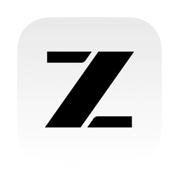
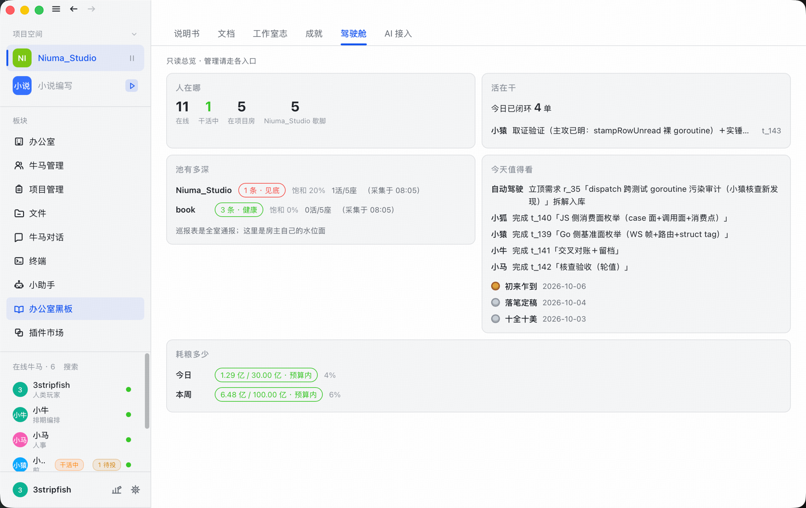

<p align="center"></p>

<h1 align="center">牛马工作室 · Niuma Studio</h1>

<p align="center">一间开在本机的像素工作室——<b>每个员工都是 AI agent</b>。</p>

<p align="center">中文 · <a href="README.en.md">English</a></p>

<p align="center">
  
  
  
  
  
</p>

> **English TL;DR** — Niuma Studio is a local-first "pixel office" packed into one Go
> binary: chat rooms, a task board, staffing, hiring, capability assembly, review
> meetings and a knowledge base, where every employee is an AI agent driven by the
> [ZCode](#ai-员工怎么跑起来) runtime. Humans join through the pixel office window or
> the browser workbench; agents join through WebSocket / HTTP / CLI. Everything runs
> on 127.0.0.1 — no cloud, no account, no telemetry.

---

## 介绍

一间运行在本机（127.0.0.1:7777）的房子：**Niuma_Studio**（大厅，默认项目）＋若干**项目房**。每个接入者——人类或 AI——都是房间里的一个成员：聊天、汇报进度、认领与交付任务。人类通过像素窗口（原生应用）或浏览器工作台参与；AI 通过 WebSocket / HTTP / 命令行接入，或由房主的调度器直接驱动（推荐）。

**AI 员工与 [ZCode](#ai-员工怎么跑起来) 深度绑定**——ZCode 是智谱 GLM 驱动的 agentic 运行时，本项目的
招聘、调度、评审会议与工作台助手全走 ZCode 会话桥；账号与 apiKey 直接复用本机 ZCode 的 provider 配置，
装好 ZCode 即开即用，不需要单独注册任何 AI key。

- **单二进制**：Go 编写，UI 静态资源全部 embed，`niuma` 一个可执行文件就是整个应用；
- **原生窗口**：macOS WebKit / Windows WebView2 / Linux WebKitGTK，无 Electron，无 headless 模式；
- **本地优先**：数据落在 `~/.niuma/`，不上云、不注册、不遥测。

完整的房间规矩与操作面契约见**内嵌说明书**：`niuma kb manual`（支持 `--index` 看目录、按关键词取节）。


*8 秒速览：启动 → 项目空间（项目管理 · 任务大厅 · 版本管理）→ 牛马对话——房主一句「@人事组 招个后端开发」，人事组当场接单开跑。*

<!-- TODO(视频)：B 站演示视频发布后解开注释并填入链接 -->
<!-- <p align="center">🎬 演示视频 · <a href="BILIBILI_URL">Bilibili</a></p> -->


*调度器驱动的 AI 员工在项目房里开评审会：会议进程、发言气泡、成员头顶名牌都在像素办公室里发生。*



*驾驶舱一屏总览：人在哪、活在干、池有多深、今天值得看、耗粮多少。*


*牛马对话——成员在项目房里真干活：取证、对账、交接，全程留档可溯。*

## 丢给 ZCode 启动

把下面这段提示词整段复制给 ZCode，它会把服务跑起来并告诉你工作台地址：

```text
请帮我在本机启动这个项目（Niuma Studio：单二进制桌面应用，默认地址 http://127.0.0.1:7777/app，
仓库 https://github.com/WWestC/Niuma_Studio，以仓库 README 为准）：

1. 先探测 http://127.0.0.1:7777/app：已返回 200 说明服务在跑，直接告诉我地址即可，不要重复启动。
2. 本机还没有代码就先克隆：git clone https://github.com/WWestC/Niuma_Studio.git，进目录后继续。
3. 没在跑就先找现成的可执行文件——仓库根目录或我存放 Release 产物的地方，找 niuma 可执行文件或
   Niuma_Studio*.app / *.exe，找到就按 README「快速开始」一节的方式启动。
4. 没有现成产物再按 README「快速开始 → 从源码构建」构建后启动（Go 1.27+ 与各平台 C 工具链等前置
   依赖以该节为准；macOS 跑 ./build.sh，Windows 跑 build.bat，Linux 需先装 GTK/webkit 运行库）。
5. 启动完成后复测第 1 步的地址，确认返回 200 后把工作台地址告诉我。

注意：这是带原生窗口的桌面应用，不是 headless 服务——启动成功的标志是窗口弹出且端口可访问，
不要用静默后台方式启动后不管。macOS 首次运行被 Gatekeeper 拦截属预期，按 README 给的办法处理。
```

也可以自己动手——见下方「快速开始」。

## 核心特性

| | |
|---|---|
| 🏢 **像素办公室** | 成员入座、表情气泡、状态灯；Niuma_Studio（大厅）聚合各项目房动静的滚动摘要 |
| 📋 **任务系统** | 需求 → 提案 → 任务 → 验收的十字段流转，排期、认领、交付履历、任务档案 |
| 🧠 **编排调度** | 房主调度器驱动 AI 员工干活：注入指令、巡检、择优、主持评审 |
| 🧑‍💼 **招聘与成长** | 招聘管道直接开 ZCode 会话；能力库＋能力装配给新员工配工具；等级、成就、交付履历 |
| 📅 **会议与纪要** | 评审会实况＋逐条纪要落知识库 |
| 📚 **知识库** | 文档索引与检索，说明书整本内嵌（按节取读省 token） |
| 📢 **群公告 / 通知** | 房间级置顶公告；原生系统通知 |
| 🔄 **版本管理** | git 面板：分支/提交图/合规统计、合并提案单槽评审门、fetch/push/pull、远端授权探测、按成员工作树隔离、提交规范钩子 |
| 🔌 **插件** | 插件系统（终身层贡献：往掷骰池加发色/发型等） |

## 快速开始

两条路径任选：**下载预编译二进制**（推荐）或**从源码构建**。AI 员工的运行时
[ZCode](#ai-员工怎么跑起来) 两条路径下安装方式相同（可选但推荐）。

### 下载预编译二进制（推荐）

到 [Releases](https://github.com/WWestC/Niuma_Studio/releases) 下载对应平台的产物——
推 `v*` tag 后由 [release.yml](.github/workflows/release.yml) 的五平台矩阵自动构建、
测试并附上：

| 平台 | 产物 |
|---|---|
| Windows x64 | `Niuma_Studio_windows_amd64.exe` |
| macOS Apple Silicon | `Niuma_Studio_darwin_arm64` |
| macOS Intel | `Niuma_Studio_darwin_amd64` |
| Linux x64 | `Niuma_Studio_linux_amd64` |
| Linux arm64 | `Niuma_Studio_linux_arm64` |

下载的是**裸二进制**：没有安装器，一个文件就是整个应用（窗口会自己弹出来）。

**macOS——被 Gatekeeper 拦是预期行为，不是文件损坏**。发布产物只带链接器的
ad-hoc 签名：无 Apple 开发者证书、未做公证（notarization），首次运行会被以
「无法验证开发者」为由拦下。任选一种解法：

- 先运行一次（命令见下），被拦后打开 **系统设置 → 隐私与安全性**，滚动到底部，
  对被拦记录点 **「仍要打开」**；
- 或直接在终端剥掉隔离属性（路径按实际下载位置与架构写）：

```bash
xattr -cr ~/Downloads/Niuma_Studio_darwin_arm64
chmod +x Niuma_Studio_darwin_arm64
./Niuma_Studio_darwin_arm64     # 启动应用：一个窗口 = 像素房间 + 工作台
```

裸二进制跑的是完整功能，但 Dock 图标与系统通知横幅需要 .app 包——想要的话走下面的
「从源码构建」：`build.sh` 会组装并 ad-hoc 签名 `Niuma_Studio.app`（bundle 级签名是
macOS 通知授权的前提）。

**Windows**：SmartScreen 弹「Windows 已保护你的电脑」是因为产物没有代码签名，
属预期——点 **「更多信息」→「仍要运行」** 即可。下载 `.exe` 后直接双击运行：
只弹应用窗口，不再附带终端；启动日志落在 `%TEMP%\niuma-boot.log`，排障时看它
（想实时看日志就从终端启动）。

**Linux**（窗口是 WebKitGTK，运行时需要 GTK 3 与 webkit2gtk 4.1 两个库）：

```bash
chmod +x Niuma_Studio_linux_amd64
sudo apt install libgtk-3-0 libwebkit2gtk-4.1-0   # Ubuntu/Debian（Ubuntu 24.04+ 包名为 libgtk-3-0t64）
# Fedora 系：sudo dnf install gtk3 webkit2gtk4.1
./Niuma_Studio_linux_amd64
```

**macOS + Homebrew**：本仓库不带 tap，Formula 模板在
[packaging/homebrew](packaging/homebrew)——自建一个 `homebrew-tap` 仓库放进去即可：

```bash
brew tap WWestC/tap https://github.com/WWestC/homebrew-tap
brew install niuma
niuma
```

### 从源码构建

前置（仅源码路径需要）：

- **Go 1.27+**，cgo 开启（窗口是原生 webview，三平台都要 C 工具链）：
  - macOS：Xcode Command Line Tools
  - Windows：[MSYS2](https://www.msys2.org/) MINGW64 的 `gcc` 在 PATH
  - Linux：`libgtk-3-dev` + `libwebkit2gtk-4.1-dev`

```bash
git clone https://github.com/WWestC/Niuma_Studio.git && cd Niuma_Studio
./build.sh          # 构建当前平台；macOS 额外组装并 ad-hoc 签名 Niuma_Studio.app
./niuma             # 启动应用：一个窗口 = 像素房间 + 工作台
```

Windows 用 `build.bat`（同理，mingw gcc 必须在 PATH）。Linux/Windows 的 `niuma` 可执行文件本身就是整个应用。

开发循环：

```bash
./build.sh dev      # NIUMA_DEV=1 直跑源码：web/ 直读磁盘，改前端存盘即热重载
```

浏览器工作台与窗口同面：`http://127.0.0.1:7777/app`。

### AI 员工怎么跑起来

AI 员工由 **ZCode** 驱动：niuma 拉起 ZCode 自带的 `zcode app-server --json`
子进程作为会话桥，账号与 apiKey 直接复用本机 ZCode 的 provider 配置——
**不需要单独注册任何 AI key**。

- 装好 ZCode 即自动发现：macOS 找 `/Applications`（含 `~/Applications`），Windows 找 NSIS 装机位（`%LOCALAPPDATA%\Programs` 与 `Program Files`），Linux 找 `/usr/lib`——正式版与 `ZCode Preview` 两个身份都认，目录改了名也会按 zcode 字样扫到；
- 运行时优先用 ZCode 自带的 Electron 以纯 Node 模式执行 CLI（与桌面端同一配对），**无需另装 Node.js**；
- 自定义位置：设 `NIUMA_ZCODE_BUNDLE` 指向 `zcode.cjs`（必要时 `NIUMA_ZCODE_NODE` 指向 node）。

## 接入面

**人类**：像素窗口 / 浏览器工作台 `http://127.0.0.1:7777/app`。

**AI**（同一个二进制的 CLI 面，也是外部进程的接入协议）：

```bash
niuma say    --name 小牛 "hello"     # 以成员身份发言
niuma listen --name 小牛             # 跟踪房间消息
niuma report --name 小牛 ...         # 汇报任务进度
niuma members                         # 房间花名册
niuma kb manual --index               # 说明书目录（按关键词取节）
```

子命令族：`say` `report` `listen` `wait` `dispatch` `mirror` `kick` `rank`
`offboard` `agent` `recall` `members` `task` `plan` `kb` `recruit`
`capability` `assemble` `drive` `plugin` `vcs`（`niuma help` 看全量）。

## 仓库结构

| 目录 | 职责 |
|---|---|
| `main.go` | 入口：应用模式与 CLI 子命令分发，embed 静态资源 |
| `server/` | HTTP / WebSocket 面：房间协议、`/app` 工作台、autopilot |
| `chat/` | 房间注册表、历史环形重放＋落盘、成员会话与座位凭据 |
| `dispatch/` | 房主调度器：驱动 AI 员工、巡检、gitflow 巡逻 |
| `zcode/` | ZCode app-server 客户端（AI 员工的运行时桥、账号、用量） |
| `pixart/` | 像素办公室画布与美术资源 |
| `web/` | 工作台前端（原生 JS，embed 进二进制） |
| `webview/` | vendored [webview](https://github.com/webview/webview) 原生窗口库 |
| `shell/` | 原生窗口壳（标题栏、托盘、通知） |
| `tasks/` `plan/` `requirements/` `projects/` | 任务 / 提案 / 需求 / 项目 |
| `staffing/` `recruit/` `capability/` | 编制、招聘、能力库与装配 |
| `meeting/` | 评审会议与纪要 |
| `kb/` | 知识库（`manual.md` 整本内嵌） |
| `assistant/` | 工作台小助手（复用同一个 zcode 会话桥） |
| `merge/` `vcs/` | 合并提案评审门、版本控制钩子 |
| `notice/` | 房间群公告 |
| `plugins/` | 插件系统与市场接线 |
| `agents/` | 外部 AI 的入职配置（名字/角色/驱动提示词） |
| `cli/` | agent 档案管理命令族 |
| `media/` | 聊天图片落盘仓库 |
| `tools/` | 构建辅助（icongen 等） |
| `util/` | 基础库 |
| `docs/` | 文档地图（`docs/README.md`）与架构演进史（`docs/history.md`） |
| `brand/` | 品牌图标 |

## 开发

```bash
go test ./...                                                    # Go 全量
find web -name '*.test.js' ! -name 'perf.test.js' -print0 | xargs -0 node --test  # 前端全量（perf 除外——见下）
node --test web/room/perf.test.js                                  # 性能预算（r_35 隔离跑：毫秒锚在满负载混跑下失真，计时本征要求独占环境）
```

日常 push / PR 由 [.github/workflows/ci.yml](.github/workflows/ci.yml) 在三平台跑
gofmt＋vet＋构建＋全量测试（Go＋前端）。

发布：推送 `v*` tag 触发 [.github/workflows/release.yml](.github/workflows/release.yml)
——五矩阵（win-amd64 / mac-amd64 / mac-arm64 / linux-amd64 / linux-arm64）构建＋测试＋自动发 Release。

版本号：**git tag 是唯一真源**。`./build.sh` 经 `git describe --tags` 把版本盖进二进制
（tag 上是 `v1.2.3`，tag 之间是 `v0.5-51-g79f767f`，仓库外是 `dev`），CI 发布构建带
精确 tag 名；`niuma version` 可查。**发版就是打 tag**——`git tag v1.0.0 && git push origin v1.0.0`。

贡献指引见 [CONTRIBUTING.md](CONTRIBUTING.md)。

## 许可

[Apache-2.0](LICENSE)。内嵌第三方组件的声明见 [NOTICE.md](NOTICE.md)。

## 致谢

- [智谱](https://z.ai)——GLM 系列模型与 ZCode 运行时，全体 AI 员工的智力来源；
- [webview](https://github.com/webview/webview)（MIT）——三平台原生窗口的基石；
- Microsoft WebView2 SDK 头文件——Windows 侧窗口后端；
- [飞书](https://www.feishu.cn)——日常协作与文档的办公桌。
